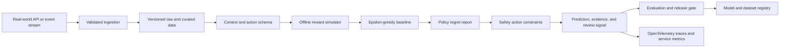

# Architecture

## Problem

Teams need to validate decision policies offline before exposing users or systems to online reinforcement learning.

## System Flow

## Components

- **Context and action schema**
- **Offline reward simulator**
- **Epsilon-greedy baseline**
- **Policy regret report**
- **Safety action constraints**

## Recommended Production Stack

- FastAPI for policy and feedback endpoints
- Vowpal Wabbit or River for online-learning baselines
- PostgreSQL for contexts, actions, propensities, and rewards
- Redis for low-latency policy serving
- MLflow for policy versioning
- OpenTelemetry for decisions and delayed rewards

## Hugging Face Tasks

- `reinforcement-learning`
- `text-classification`
- `feature-extraction`
- `sentence-similarity`

## Model Architecture

The included baseline is a transparent token-prototype model. Training builds
per-label token weights and inverse-document-frequency retrieval weights from
the synthetic training split. The runtime returns a prediction, confidence,
review flag, and evidence documents. This baseline is intentionally small so
it can run in CI without paid compute.

For production, compare it with domain embeddings, gradient-boosted models, or
fine-tuned transformer models using the same held-out evaluation contract.

## Production Boundaries

- Validate and version all input schemas.
- Keep human review for low-confidence or high-impact decisions.
- Store prompts, traces, model versions, and dataset versions together.
- Do not treat synthetic evaluation performance as production evidence.
- Add authentication, authorization, encryption, and retention controls.

## Known Risks

Offline simulated rewards cannot prove online safety or business impact. Real experiments require review and guardrails.
